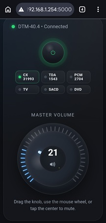
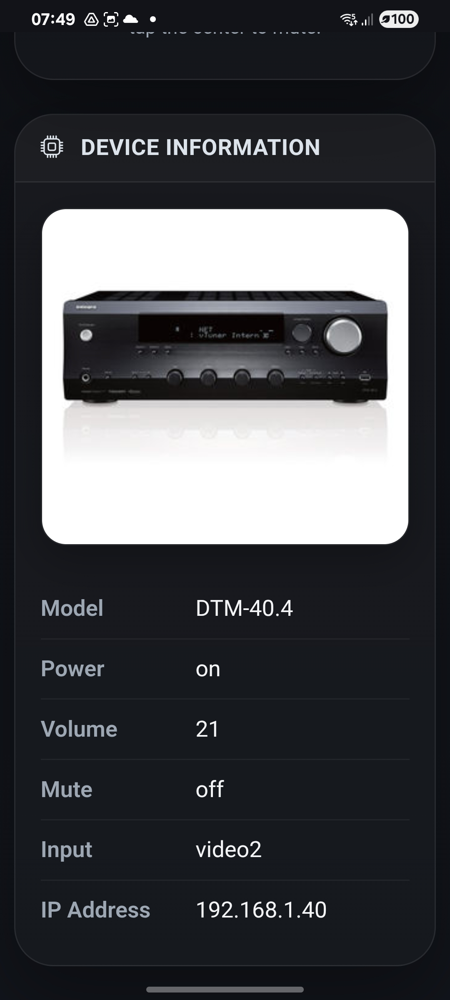

# Onkyo Receiver Web Control

A lightweight Flask web application for controlling an Onkyo / Integra network receiver over eISCP.

<p align="center">
  
  
</p>

---

# Features

- Power ON / OFF control
- Hardware-style volume knob
- Mute / unmute from knob center
- Input selector buttons with LED indicators
- Live status synchronization
- Receiver connection monitoring
- Mobile-friendly interface
- Standby / connected / disconnected indicators
- Flask backend with eISCP support
- `.env`-based configuration

---

# Screenshots

Features a hardware-inspired interface:

- illuminated power button
- LED input selector buttons
- analog-style volume knob
- real-time status updates

---

# Requirements

- Python 3.9+
- Onkyo / Integra receiver with eISCP support
- Local network connection

---

# Installation

Clone the repository:

```bash
git clone https://github.com/git-moiseev/onkyo-eiscp.git
cd onkyo-eiscp
```

Install dependencies:

```bash
pip install -r requirements.txt
```

Copy the example environment file:

```bash
cp .env.example .env
```

| Variable      | Description                      |
| ------------- | -------------------------------- |
| `DEVICE_IP`   | Receiver IP address              |
| `FLASK_HOST`  | Flask bind host                  |
| `FLASK_PORT`  | Flask bind port                  |
| `FLASK_DEBUG` | Enable Flask debug mode          |
| `INPUT_MAP`   | JSON dictionary of input buttons |


## Running the Application

```bash
/usr/bin/flask run --host 0.0.0.0 --port 5000
```

## Open in browser:

```
http://YOUR_SERVER_IP:5000
```

## Run as systemd Service

```ini
[Unit]
Description=Onkyo Receiver Web Control
After=network.target

[Service]
Type=simple
User=YOUR_USER
WorkingDirectory=/opt/onkyo-eiscp
Environment="PATH=/opt/onkyo-eiscp/.venv/bin"
ExecStart=/opt/onkyo-eiscp/.venv/bin/python /opt/onkyo-eiscp/app.py
Restart=always
RestartSec=5

[Install]
WantedBy=multi-user.target
```

```bash
sudo systemctl daemon-reload
sudo systemctl enable onkyo-web.service
sudo systemctl start onkyo-web.service
```

# Notes

- Receiver and Flask app must be on the same local network.
- UI automatically detects connection status.
- Input LEDs turn off when receiver enters standby.
- Mobile devices do not display toast notifications.
- Volume jumps larger than 5 points are ignored to prevent accidental jumps.

# Based on 

- https://github.com/miracle2k/onkyo-eiscp
- Command dictionary eiscp-commands.yaml
